* 原文<a href="https://www.kaggle.com/pmarcelino/comprehensive-data-exploration-with-python">Comprehensive data exploration with Python
</a>
# 使用Python进行综合性数据探索

### 最困难的事情就是理解你自己

这句话属于米利都的泰勒斯。泰勒斯是一位希腊/印第安人哲学家，数学家和天文学家，被公认为西方文明中第一个享有娱乐和参与科学思想的人。  

我不会说知道你的数据是数据科学中最困难的事情，但这是非常耗时的。因此，很容易忽略这个初始步骤，很快就会跳入水中。  

所以我试着在跳入水中之前学会如何游泳。基于Hair等。 （2013年）“检查您的数据”一章中，我尽我所能对数据进行了全面而非详尽的分析。在这个内核中，我还没有报告过严格的研究，但是我希望它对社区有用，所以我分享了如何将这些数据分析原理应用于这个问题。  
（以上内容来自google翻译，下面即将开始我的蹩脚英语翻译）  

放下我给这章起的奇怪名字不谈，我们要在这个kernel做的事情如下：
- **理解问题**  
我们将会审查每一个变量，并且对他们的意义和对于这个问题的重要性做一个大致的分析
- **单变量研究**  
我们将会将注意力放在研究因变量(SalePrice)并且尝试去更深入的理解这个变量
- **多变量研究**  
我们将会尝试理解因变量和自变量之间的关系
- **基本的数据清洗**  
我们将会清洗数据集并且做一些缺失数据，异常值和分类变量（文本变量）的处理
- **测试猜想**  
我们将会检查我们的数据是否符合大多数多变量技术（机器学习模型）猜测的要求  

现在，让我们开始这段数据探索之旅吧！


```python
#邀请来参加kaggle 聚会的人们
import pandas as pd
import matplotlib.pyplot as plt
import seaborn as sns
import numpy as np
from scipy.stats import norm
from sklearn.preprocessing import StandardScaler
from scipy import stats
import warnings
warnings.filterwarnings('ignore')
%matplotlib inline
```


```python
#带上六包？(bring in the six packs)
df_train=pd.read_csv('train.csv')
```


```python
#检查他们的穿着
df_train.columns
```


    Index(['Id', 'MSSubClass', 'MSZoning', 'LotFrontage', 'LotArea', 'Street',
           'Alley', 'LotShape', 'LandContour', 'Utilities', 'LotConfig',
           'LandSlope', 'Neighborhood', 'Condition1', 'Condition2', 'BldgType',
           'HouseStyle', 'OverallQual', 'OverallCond', 'YearBuilt', 'YearRemodAdd',
           'RoofStyle', 'RoofMatl', 'Exterior1st', 'Exterior2nd', 'MasVnrType',
           'MasVnrArea', 'ExterQual', 'ExterCond', 'Foundation', 'BsmtQual',
           'BsmtCond', 'BsmtExposure', 'BsmtFinType1', 'BsmtFinSF1',
           'BsmtFinType2', 'BsmtFinSF2', 'BsmtUnfSF', 'TotalBsmtSF', 'Heating',
           'HeatingQC', 'CentralAir', 'Electrical', '1stFlrSF', '2ndFlrSF',
           'LowQualFinSF', 'GrLivArea', 'BsmtFullBath', 'BsmtHalfBath', 'FullBath',
           'HalfBath', 'BedroomAbvGr', 'KitchenAbvGr', 'KitchenQual',
           'TotRmsAbvGrd', 'Functional', 'Fireplaces', 'FireplaceQu', 'GarageType',
           'GarageYrBlt', 'GarageFinish', 'GarageCars', 'GarageArea', 'GarageQual',
           'GarageCond', 'PavedDrive', 'WoodDeckSF', 'OpenPorchSF',
           'EnclosedPorch', '3SsnPorch', 'ScreenPorch', 'PoolArea', 'PoolQC',
           'Fence', 'MiscFeature', 'MiscVal', 'MoSold', 'YrSold', 'SaleType',
           'SaleCondition', 'SalePrice'],
          dtype='object')


## 1. 所以，我们想要看到什么？
为了理解我们的数据集，我们需要观察每一个变量并尝试去理解他们的意义以及和这个题目的关系。我知道这很耗时间，但是这会对我们理解数据集很有帮助。  

为了在我们的分析中设立一些规则，我们可创建一个拥有如下列的Excel电子表格：
- **变量**- 变量名
- **变量类型**- 变量种类的名称。这里我们有两种可能的值：数值型和类别型。数值型就是他们的结果是数字的变量，而类别型就是他们的结果是种类。  
- **类别**- 变量的所属的类别。这里我们定义三种可能的类别：建筑，空间和位置。建筑就是建筑的一些物理特征(比如OverallQual)，空间就是表述房屋空间性质的变量（比如TotalBsmtSF）最后位置就是能给出这个房屋地理位置信息的变量（比如Neighborhood）
- **预测**- 这些自变量最终都会影响我们的预期变量SalePrice，我们用一个种类范围：高，中，低来作为可能的取值
- **结论**- 当我们看完这些数据后我们的结论，我们将会使用和‘预测’同样的种类范围的取值
- **评论**- (Any general comments that occured to us)  

变量类型和类别只是为了以后可能的引用需要，预测这一列很重要因为他帮助我们提高我们对数据的第六感。为了填充这一列，我们需要阅读每一个变量的描述，并且问自己：
- 当我们买房子时我们会考虑这个变量吗？（比如 当我们做自己的买房梦时，是否会在乎‘Masonnry veneer type’？）
- 如果是这样的话，那么这个变量会有多重要？（比如房屋外部拥有极好的材料装饰而不是很差的材料对你买房的影响大吗？如果是较好的材料呢？）
- 这个信息是否已经在其他变量中被显示了呢？（比如，如果LandContour给出了（房子的平整度），那么我们是否还需要LandSlope这个变量？）  

在这复杂令人抓狂的处理之后，我们可以过滤这个电子表格并且仔细审查那些有着高预测的变量。然后我们可以画出这些变量和SalePrice的图像，然后填充结论那一列，也就是我们预测的正确性。  

我做了上述的操作后，总结出一下的变量在我们的问题中有极大的作用：
- **OverallQual**（这个变量我并不喜欢，因为我不知道他是怎么计算的，当然你可以通过其他的变量来预测这个OverallQual变量）
- **YearBuilt**（建造时间）
- **TotalBsmtSF**
- **GrLivArea**  

我最终获得了两个建筑类别的变量（OverallQual和YearBuilt）和两个空间变量（TotalBsmtSF和GrLivArea）。这可能有点出乎预料，因为这和房地产最重要的因素：地理位置，地理位置，地理位置（重要的事情说三遍2333）不相符。也许是因为这个快速的数据检查过程在对待类别型变量有些太粗糙了。比如，我本以为Neigborhood这个变量会更有相关性一些，但是最后的结果是我把它剔除了。也许这和我使用scatter数据而不是用boxplots的关系，boxplots对于类别型数据的可视化更合适一些。我们可视化数据的方式经常会影响我们的结论。  

无论如何，这部分最关键的部分就是对我们的数据有一点最初的想法和预测，因此，我认为我已经达到了我们的目标。现在开始我们讲会少一点讲述，多一点实践。让我们开始吧！  

## 2. 最重要的最先：分析SalePrice
SalePrice是我们客人来到这里的原因。这就像我们将要举办一场聚会，我们总是需要一个理由去那。通常，女人是我们的去那的理由（免责申明：适用于男性，当然跳舞和喝酒也是，随你的喜好）  

那么就采用女人这个原因来分析，让我们编一个小故事：我们是如何与SalePrice相遇的。  
所有的事情都是发生在Kaggle聚会的那一天，当我们在找舞伴的时候。在寻找了半天后，我们看到了一个女孩，在吧台旁边，穿着舞鞋。这正是她想要来跳舞的信号。我们花了很多的时间去做预测性数据建模，参加数据分析竞赛，那么和女生交谈肯定不是我们的长项，但是即使这样，我们还是应该试一试（不然永远单身狗啊233）：
<q>
    你好，我是kaggly！你呢？<br>
    SalePrice.<br>
    多么美的一个名字啊！请问可以给我一些关于你（SalePrice）的信息吗？我刚构建了一个计算两个人之间有多大概率在一起的模型。我想要把这个模型放在我们两之间试一下！
</q>


```python
#对于数据的描述性总结
df_train['SalePrice'].describe()
```


    count      1460.000000
    mean     180921.195890
    std       79442.502883
    min       34900.000000
    25%      129975.000000
    50%      163000.000000
    75%      214000.000000
    max      755000.000000
    Name: SalePrice, dtype: float64


很好～看起来你的最低房价比0大。简直太棒了！你没有任何一个特点会破坏我的模型！你可以给我发一张你的照片吗？比如你在海滩的照片。。或者你在体育馆的自拍？


```python
#矩形图
sns.distplot(df_train['SalePrice']);
```


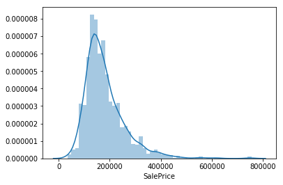


Ah！你在外面竟然也用seaborn！我也发现：  
- **和正态分布有偏差**  
- **有明显的正偏态**
- **数据显示尖锐**

这真是太有趣了！SalePrice，你可以给我你的一些个人信息吗？


```python
#偏态和峰度
print("Skewness: %f"%df_train['SalePrice'].skew())
print("Kurtosis: %f"%df_train['SalePrice'].kurt())
```

    Skewness: 1.882876
    Kurtosis: 6.536282


简直不可思议！如果你相信我的计算器是对的，那么我们在一起成功的概率是97.834657%,我觉得我们可以以后约见面！请记下我的手机号，如果你下周五有空请打给我！过段时间见，鳄鱼！（原文crocodile。。。我本来想翻恐龙的。。。不知道啥意思。。。）  
## SalePrice，她的闺蜜和她的爱好
选择你即将开始努力的方向是需要战略思维的。SalePrice一走，我们就登上了Facebook。是的，现在一切都变得严肃了起来。记住，这不是闹着玩(this is not stalking)，这是对个人的信息挖掘，如果你懂得我在说什么的话（抱歉，不懂。。。）  

根据她的信息，我们发现和她有着同样的好友。除了Chuck Norris（查克·诺里斯，美国著名武术家，世界著名空手道巨星，同时亦是有名的武功电影明星），我们发现她也喜欢了GrLivArea和TotalBsmtSF。不仅如此，她也喜欢OverallQual和yearBuilt。这看起来有戏！  

为了从调查中获得更多的信息，我们开始仔细查看我们和她的共同好友，之后我们将会把注意力放在我们和她的共同爱好上。  


### 她和数字型变量的关系


```python
#plot出grlivarea／salePrice的图像
var='GrLivArea'
data=pd.concat([df_train['SalePrice'],df_train[var]],axis=1)
data.plot.scatter(x=var,y='SalePrice',ylim=(0,800000));
```


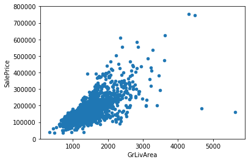


Hmmm,看起来SalePrice和GrLivArea是老朋友了，有着线性关系  

那么TotalBsmtSF呢？


```python
#plot出totalBsmtSF／SalePrice的图像
var='TotalBsmtSF'
data=pd.concat([df_train['SalePrice'],df_train[var]],axis=1)
data.plot.scatter(x=var,y='SalePrice',ylim=(0,800000));
```


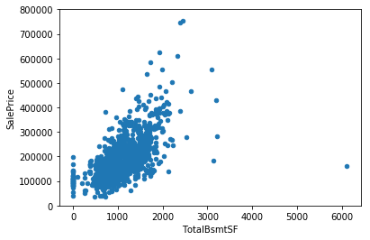


TotalBsmtSF也是SalePrice的一个好朋友，但是这看起来有更多的感情关系！一切都看起来很正常（一个线性关系？）。除此之外，很明显TotalBsmtSF把自己封闭起来，对SalePrice的信任为0.

### 和类别型变量的关系


```python
# 使用box plot overallQual／SalePrice
var='OverallQual'
data=pd.concat([df_train['SalePrice'],df_train[var]],axis=1)
f,ax=plt.subplots(figsize=(8,6))
fig=sns.boxplot(x=var,y="SalePrice",data=data)
fig.axis(ymin=0,ymax=800000);
```


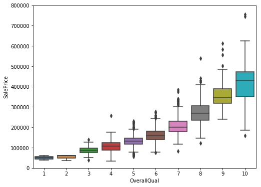


就像所有的漂亮女孩一样，SalePrice喜欢OverallQual（给自己的便条：考虑一下 麦当劳作为第一次约会的地点是否合适）


```python
var='YearBuilt'
data=pd.concat([df_train['SalePrice'],df_train[var]],axis=1)
f,ax=plt.subplots(figsize=(16,8))
fig=sns.boxplot(x=var,y="SalePrice",data=data)
fig.axis(ymin=0,ymax=800000);
plt.xticks(rotation=90);
```


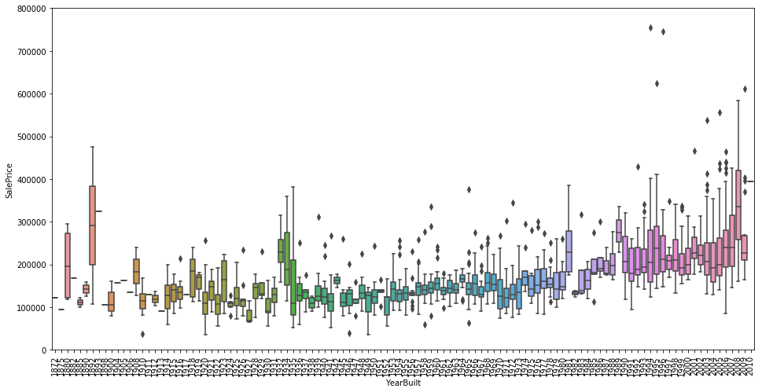


虽然这并不是一个很强的趋势，但是我们可以说SalePrice更倾向于花更多的钱买一个新的东西而不是老古董。  
**Note**：我们不知道SalePrice是否具有持续性的价格（constant price）。持续性价格将会移除激增的效果。如果SalePrice不是持续性的，那么不同年带的价格一定是课比较的。  

### 总结
把故事放在一边不说，我们可以总结出如下规律：  
- GriLivArea和TotalBsmtSF看起来和SalePrice有着线性联系。他们两个与SalePrice的关系都是正相关的，也就是说一个变量增加，另一个变量也会跟着增加。在TotalBsmtSF这个例子中，我们看到这个线性关系的倾斜度十分大。  
- OverallQual和YearBuilt也看起来和SalePrice很有关系。在OverallQual中这种关系表现的更明显一些，它的箱形图向我们展示了SalePrice是如何随着overall quality的增长而增长的。  

我们仅仅分析了4个变量，但是还有很多其他需要我们分析的变量。这里的技巧应该是选择正确的特征（feature selection）而不是定义各种变量之间复杂的关系（feature engineering）。  

也就是说，让我们把小麦从草料中分离出来（选择出有用的feature）  


## 3. 保持冷静，继续前进

到目前为止，我们跟随自己的直觉并且分析了我们认为重要的变量。尽管我们对自己的分析给了客观的特征，我们不得不说我们开始的起点是主观的。  

作为一名工程师，我非常不适应这种方式。我接受到的所有的教育都是关于如何培养一种规则式的思维，能够经受住主观臆断的诱惑。这种教育当然是有原因的，如果你总是主观的对待结构工程然后你将会看到物理把一切都摧毁了，这样（主观）有害的。  

因此，让我们克服惰性的主观做一些客观的分析。  

### 血浆汤（The plasma soup 我也不知道这名字为啥这么可怕）
探索整个数据集，我们将开始使用一些使用的方法来让我们的血浆汤更有意义：  
- 相关矩阵（heatmap 式）  
- SalePrice的相关矩阵（缩放heatmap式）
- 画出和结果相关度最高的变量之间的图像   

### 相关矩阵


```python
#相关矩阵
corrmat=df_train.corr()
f,ax=plt.subplots(figsize=(12,9))
sns.heatmap(corrmat,vmax=.8,square=True);
```


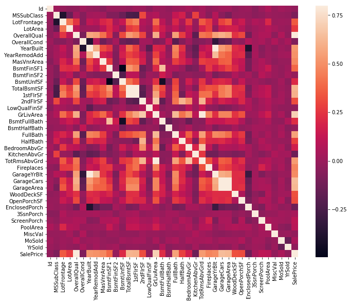


在我看来，这张热力图是获得这些数据和他们彼此关系概览的最佳方式。（感谢@Seaborn！）  

刚开始看这张图，有两个红色（我觉得是白色。。）的正方形引起了我的注意。第一个是TotalBsmtSF和1stFlrSF，第二个是GarageX。这两种情况都向我们展示了这些变量之间相关性程度有多大。事实上，这种关系强大到可以说明二者之间具有多重共线性。如果我们考虑这些变量，那么我们可以总结出他们几乎给出了相同的信息，因此多重共线性发生了。热力图是一个很好的助手帮助我们检测这种情况的发生，和一些在特征选择中发生的问题。这是一个必要的工具。  

另一个引起我注意的是SalePrice的相关系数。我们可以看到我们的GrLivArea，TotalBsmtSF和OverallQual在对我们打着招呼。但是我们也看到其他一些变量也应该考虑到。这就是我们接下来要做的事情。  

### SalePrice 的相关矩阵（压缩热力图）


```python
#SalePrice 相关矩阵
k=10 # 热力图的变量个数
cols=corrmat.nlargest(k,'SalePrice')['SalePrice'].index
cm=np.corrcoef(df_train[cols].values.T)
sns.set(font_scale=1.25)
hm=sns.heatmap(cm,cbar=True,annot=True,square=True,fmt='.2f',
              annot_kws={'size':10},yticklabels=cols.values,
              xticklabels=cols.values)
plt.show()
```


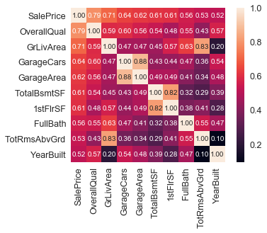


根据我们的水晶球，有好几个变量和SalePrice最相关。下面是我对这些变量的想法：
- OverallQual，GrivArea和TotalBsmtSF都和SalePrice有很强的关联性。
- GarageCars和GarageArea同样如此，但是正如我们上一节中讨论到的，车能够塞进停车库的数量就是停车库的面积大小。GarageCars和GarageArea就像两个双胞胎，你永远不能分清楚谁是谁。因此我们只要其中一个就可以了。我们可以保留GarageCars因为它和SalePrice的关联度更高。
- TotalBsmtSF和1stFloor他们两个看起来也像双胞胎，我们可以保留TotalBsmtSF，也就是验证了我们的第一次猜测是正确的（在So...What can we expect？）  
- FullBath？？？真的吗？？？（我怎么知道。。。）
- TotRmsAbvGrd和GrLivArea，又是两个双胞胎，这个数据集是从切尔诺贝利来的吗（切尔诺贝利曾经发生核泄漏造成灾难 译者注）
- YearBuilt 看起来YearBuilt和SalePrice有着较弱的关联性啊。老实讲，我一想到建造时间久害怕，因为我开始觉得我需要做一些时间序列分析来证明这个想法。我把这个作为家庭作业给你（给了我也不会写。。。）  

让我们接着plot数据。。。

### 画出SalePrice和其相关变量的图像

准备好看接下来要发生的事情。我必须承认我第一次看这些图的时候这些图给我留下了深刻的印象。如此多的信息都聚集在一个很小的空间内。再次，感谢@Seaborn！


```python
#画图
sns.set()
cols=['SalePrice','OverallQual','GrLivArea','GarageCars',
      'TotalBsmtSF','FullBath','YearBuilt']
sns.pairplot(df_train[cols],size=2.5)
plt.show();
```


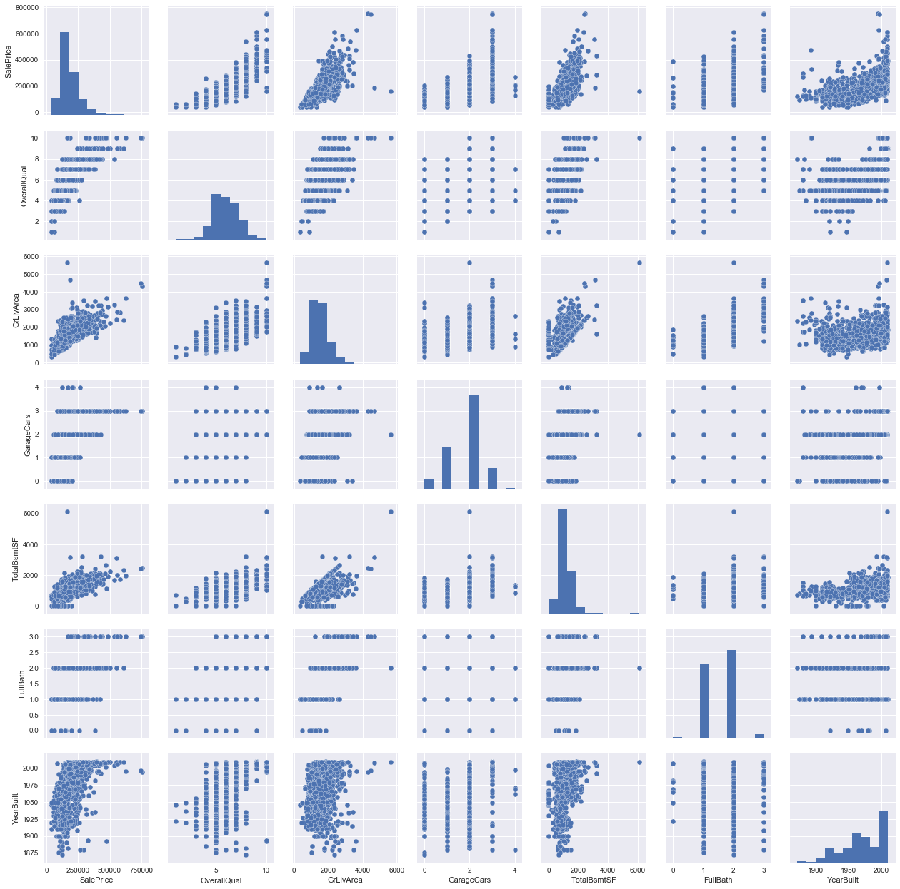


虽然我们已经知道了一些主要的特征，这些小的图像给了我们关于这些变量关系一个有理有据的想法。  

其中TotalBsmtSF和GrLiveArea的那张图会发现很有趣。在这张图中我们可以看到那些点画出了一条直线，就像一个边界线一样。这样大多数点都在这条直线下面很有用。地下室的面积可以等于地面上的居住面积，但预计地下室面积不会比地面上的居住面积大（除非你试图购买地堡）  

关于SalePrice和YearBuilt的图像也引发我的思考。在一群云点中，我们看到了一个很隐约的趋势（有创意点。。乐观点）。我们可以看到在这些云点的上方同样有这样的趋势。同时，注意到那些最近年的点更倾向于停留在限制点处（我只是想说价格在最近增长的更快了）  
好了，到目前为止，测试已经足够了。让我们进入下一阶段：缺失数据！  


## 4. 缺失数据

在我们思考缺失数据时有两个重要的问题：  
- 缺失数据有多普遍？
- 缺失数据是否存在某种规律或者就是随机的？  

对于这些问题的回答对于实际操作十分重要因为缺失数据能够表明一种样本容量的减少。这将阻止我们进行进一步的分析。不仅如此，通过一个更大的视角来说，我们需要确保缺失的数据处理没有偏差或者隐藏了真相。  


```python
#缺失的数据
total=df_train.isnull().sum().sort_values(ascending=False)
percent=(df_train.isnull().sum()/df_train.isnull().count()).sort_values(ascending=False)
missing_data=pd.concat([total,percent],axis=1,keys=['Total','Percent'])
missing_data.head(20)
```


<div>
<style>
    .dataframe thead tr:only-child th {
        text-align: right;
    }

    .dataframe thead th {
        text-align: left;
    }

    .dataframe tbody tr th {
        vertical-align: top;
    }
</style>
<table border="1" class="dataframe">
  <thead>
    <tr style="text-align: right;">
      <th></th>
      <th>Total</th>
      <th>Percent</th>
    </tr>
  </thead>
  <tbody>
    <tr>
      <th>PoolQC</th>
      <td>1453</td>
      <td>0.995205</td>
    </tr>
    <tr>
      <th>MiscFeature</th>
      <td>1406</td>
      <td>0.963014</td>
    </tr>
    <tr>
      <th>Alley</th>
      <td>1369</td>
      <td>0.937671</td>
    </tr>
    <tr>
      <th>Fence</th>
      <td>1179</td>
      <td>0.807534</td>
    </tr>
    <tr>
      <th>FireplaceQu</th>
      <td>690</td>
      <td>0.472603</td>
    </tr>
    <tr>
      <th>LotFrontage</th>
      <td>259</td>
      <td>0.177397</td>
    </tr>
    <tr>
      <th>GarageCond</th>
      <td>81</td>
      <td>0.055479</td>
    </tr>
    <tr>
      <th>GarageType</th>
      <td>81</td>
      <td>0.055479</td>
    </tr>
    <tr>
      <th>GarageYrBlt</th>
      <td>81</td>
      <td>0.055479</td>
    </tr>
    <tr>
      <th>GarageFinish</th>
      <td>81</td>
      <td>0.055479</td>
    </tr>
    <tr>
      <th>GarageQual</th>
      <td>81</td>
      <td>0.055479</td>
    </tr>
    <tr>
      <th>BsmtExposure</th>
      <td>38</td>
      <td>0.026027</td>
    </tr>
    <tr>
      <th>BsmtFinType2</th>
      <td>38</td>
      <td>0.026027</td>
    </tr>
    <tr>
      <th>BsmtFinType1</th>
      <td>37</td>
      <td>0.025342</td>
    </tr>
    <tr>
      <th>BsmtCond</th>
      <td>37</td>
      <td>0.025342</td>
    </tr>
    <tr>
      <th>BsmtQual</th>
      <td>37</td>
      <td>0.025342</td>
    </tr>
    <tr>
      <th>MasVnrArea</th>
      <td>8</td>
      <td>0.005479</td>
    </tr>
    <tr>
      <th>MasVnrType</th>
      <td>8</td>
      <td>0.005479</td>
    </tr>
    <tr>
      <th>Electrical</th>
      <td>1</td>
      <td>0.000685</td>
    </tr>
    <tr>
      <th>Utilities</th>
      <td>0</td>
      <td>0.000000</td>
    </tr>
  </tbody>
</table>
</div>


现在让我们分析这个表来理解如何处理这些缺失数据。  

我们将会考虑扔掉缺失率超过15%的数据，就假装他们不曾存在过一样（笔者持保留态度）这就意味着在这种情况下，我们将不需要尝试任何手段去处理这些缺失数据。这里有一大堆特征我们应该扔掉，比如PoolQC，MiscFeature，Alley。那么问题是：我们是否会错过这些数据给出的信息呢？我并不这样认为。这些特征看起来并不是那么重要，因为在我们买房子时这些特征的大多数并不是我们考虑的因素（也许正是这样所以数据才缺失了？）不仅如此，让我们更仔细的看看这些特征，我们会发现PoolQC，MiscFeature和FirePlaceQu中有着强烈的异常值，因此删掉他们问题并不大。  

在剩下的数据中，我们可以看到GarageX的特征有着相同的数据缺失量，我打赌这些缺失数据代表着他们来源于同样的观测。（虽然我并不会检验我的猜测；这里仅有5%而我们不应该花费20的力量在5的问题上。）因为和停车最有关系的已经通过GarageCars表现出来了，并且我们现在仅仅是在讨论缺失率5%的数据，我将会删掉我上述提到的GarageX的变量，对于BsmtX也是同样的操作。  

至于MasVnrArea和MasVnrType，我们觉得他们并不是必要的。同时，他们和YearBuilt和OverallQual有着强烈的关联性，因此删除他们的话我们不会丢失信息。  

最后，对于Eletrical，我们有一个丢失的信息。因为仅仅只是一个，所以我们将会把丢失的这一行删去，继续使用。  

总的来说，处理丢失数据，我们将会删除除了Eletrical外的所有缺失数据。对于Eletrical我们将会删除丢失数据的那一行。  


```python
#处理丢失数据
df_train=df_train.drop((missing_data[missing_data['Total']>1]).index,1)
df_train=df_train.drop(df_train.loc[df_train['Electrical'].isnull()].index)
df_train.isnull().sum().max() #检查是否还有数据缺失
```


    0


## 异常值

异常值是我们需要知道的问题。为什么？因为异常值会显著的影响我们的模型，并且能够给我们提供很有价值的信息，一些关于特殊行为的视角。  

特征值是一个很复杂的课题并且需要我们更多的关注。这里我们仅仅对SalePrice的标准偏离和一些图像做快速的分析。  

### 单一变量分析

对于这里，最初的想法就是建立起一个临界值定义什么是异常量。因此我们需要将变量标准化。这边篇文章中，数据标准化意味着将数据转变成平均值为0，标准偏差为1的分布。  


```python
# 标准化数据
saleprice_scaled=StandardScaler().fit_transform(df_train['SalePrice'][:,np.newaxis]);
low_range=saleprice_scaled[saleprice_scaled[:,0].argsort()][:10]
high_range=saleprice_scaled[saleprice_scaled[:,0].argsort()][-10:]
print('最低异常值分布：')
print(low_range)
print('\n最高异常值分布')
print(high_range)
```

    最低异常值分布：
    [[-1.83820775]
     [-1.83303414]
     [-1.80044422]
     [-1.78282123]
     [-1.77400974]
     [-1.62295562]
     [-1.6166617 ]
     [-1.58519209]
     [-1.58519209]
     [-1.57269236]]
    
    最高异常值分布
    [[ 3.82758058]
     [ 4.0395221 ]
     [ 4.49473628]
     [ 4.70872962]
     [ 4.728631  ]
     [ 5.06034585]
     [ 5.42191907]
     [ 5.58987866]
     [ 7.10041987]
     [ 7.22629831]]


那么SalePrice是如何挑选他的衣服的呢：  
- 低异常值分布都差不多而且都离0不远
- 高异常值都离0很远。一些值完全超出了范围（7）

那么现在我们将不会把这些值考虑为异常值但是我们需要对这两个7的值保持谨慎。  

### 双变量分析

我们已经把如下图像牢记在心了。但是当我们从一个新的角度来看这个问题的时候，总有一些新发现。正如Alan Kay所说，一个视角的转变胜过80点智商。


```python
# 双变量分析 SalePrice／GrlivArea
var='GrLivArea'
data=pd.concat([df_train['SalePrice'],df_train[var]],axis=1)
data.plot.scatter(x=var,y='SalePrice',ylim=(0,800000));
```


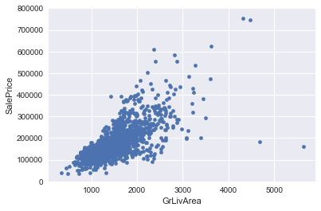


这张图向我们展示了：
- 有两个GrLivArea的点看起来很奇怪并且他们并没有和云点在一块。我们可以推测这发生了什么。也许他们代表着工业区域这样就可以解释为什么他们的低价格。我并不确定，但是我可以很有自信的说这两个点并不是典型情况。因此我们定义他们为异常值并且删去他们
- 两个图上最上面的值为7的观测点，就是我们之前提到要注意的情况。他们开起来像是特殊情况，但是他们又和整幅图的趋势一致，因此我们选择保留这两个点。


```python
# 删除异常值的点
df_train.sort_values(by='GrLivArea',ascending=False)[:2]
df_train=df_train.drop(df_train[df_train['Id']==1299].index)
df_train=df_train.drop(df_train[df_train['Id']==524].index)
```


```python
# 双变量分析 SalePrice／TotalBsmtSF
var='TotalBsmtSF'
data=pd.concat([df_train['SalePrice'],df_train[var]],axis=1)
data.plot.scatter(x=var,y='SalePrice',ylim=(0,800000));
```


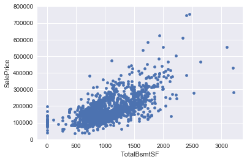


我们很想减少一些观测点，比如当TotalBsmtSF>3000的是啊后，但是我觉得这并不值得。我们可以忍受这些点，所以我们并不做任何事。

## 5. 开始最难的部分

在艾恩·兰德的小说《'Atlas Shrugged》中，有一个经常被重复的问题：约翰·高尔特是谁？这本书的一大部分是关于寻求发现这个问题的答案。 

我感觉很迷茫。谁是SalePrice？  

这个问题的回答隐藏在对于多变量分析的测试中。我们已经做了一些数据清洗并发现了一些关于SalePrice的信息。现在就可以深入的理解SalePrice是如何和其他数据假设联合起来使我们可以应用多变量技术。  

根据Hair et al.(2013)，有四个猜想需要测试：
- **正态性**- 当我们论及正态性，我们指的是这个数据应该看起来符合正态分布。这对于我们的测试十分重要，因为有好几个数据测试都依赖这个特性。在这部分里，我们仅检查单变量的相对于SalePrice的正态性（这是一个不完全的手段）记住：单变量的正态性并不能代表多变量的正态性（也就是我们想要验证的），但是仅仅这样做就有些帮助了。另一个我们需要考虑的细节就是在大数据集中（观测点大于200），正态性并不算一个非常重要的指标。但是如果我们解决了正态性，我们将会避免其他很多问题，比如异方差问题，这也正是为什么我们要做这个分析。  
- **同方差性**- 我希望我写的是对的。同异方差是指“假设：因变量在整个预测变量范围内表现出相同的方差水平”。同方差性质是我们希望得到的，因为我们希望误差项在自变量的所有取值都是相同的。
- **线性**- 最常见的寻找线性就是检查画出的图像并且寻找合适的线性模型。如果数据模式不是线性的，那么不妨做数据转换。但是我们不会做这个过程因为大多数我们plot处来的图像都显示了线性关系。  
- **协同方差的缺失**- 协同方差，就像定义写的那样：当一个变量的方差和另一个相关时。举个例子来说，如果一个正相关误差系统的产生一个负相关的误差，那么这意味着着两个变量之间有着联系。这通常以时间序列发生，其中一些模式和时间有关，我们不会涉及到这部分，但是如果你发现了什么，请尝试加上一个可以解释你得到的信息的变量。这就是解决协同方差最普遍的方式。  

你觉得Elvis会如何评价这段长长的解释？（反正我是觉得我翻译的很糟糕。。）少点讨论，多点实践？也许是这样。对了，你知道Elvis最近最大的轰动是什么吗？  

（...)  

浴室的地板。  

### 寻找正态性  

这一部分的重点就是以一个非常片面的方式测试SalePrice。我们将会把重点放在：  
- **矩形图**- 峰值和偏度  
- **正态概率图**- 数据分布将会紧紧的贴合代表正态分布的那条线  


```python
#矩形图和正态概率分布图
sns.distplot(df_train['SalePrice'],fit=norm)
fig=plt.figure()
res=stats.probplot(df_train['SalePrice'],plot=plt)
```


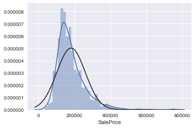


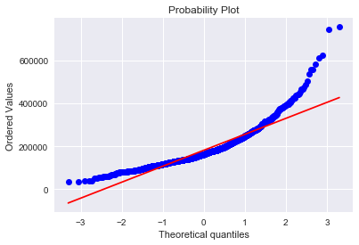


好的，SalePrice并不是正态的，它显示出尖峰性，正偏态并且并不贴合那条正态分布的直线。  

但是没有信息丢失了。一个简单的数据转换就可以解决这个问题。这是个你可以在数据书里学到的很有用的方法：在正偏态分布的情况下，log 转换表现的很好。当我发现这个事情的时候，我感觉就像Hogwarts的学生发现了一个新潮的单词（spell拼写）。  

Avada kedavra！（简直太棒了，爱沙尼亚语：打开雪松！（什么鬼））  


```python
#使用log转换
df_train['SalePrice']=np.log(df_train['SalePrice'])

#转换后的矩形图和正态概率分布图
sns.distplot(df_train['SalePrice'],fit=norm);
fig=plt.figure()
res=stats.probplot(df_train['SalePrice'],plot=plt)
```


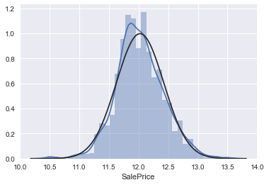


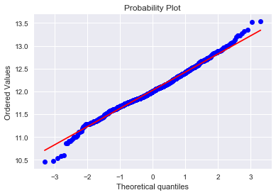


机智的我解决了这个问题，现在我们来看看GrLivArea


```python
#矩形图和正态概率分布图
sns.distplot(df_train['GrLivArea'],fit=norm)
fig=plt.figure()
res=stats.probplot(df_train['GrLivArea'],plot=plt)
```


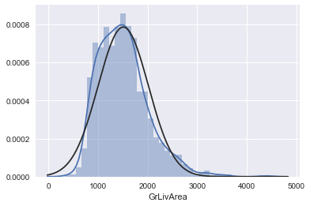


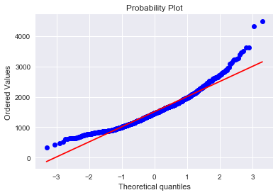


看起来有些偏态


```python
#数据转换
df_train['GrLivArea']=np.log(df_train['GrLivArea'])

#转换后的矩形图和正态分布概率图
sns.distplot(df_train['GrLivArea'], fit=norm);
fig = plt.figure()
res = stats.probplot(df_train['GrLivArea'], plot=plt)
```


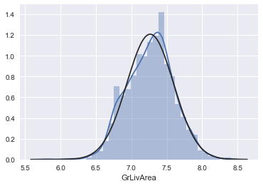


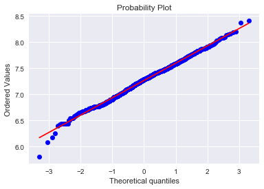


那下一个呢？


```python
# 矩形图和正态分布概率图
sns.distplot(df_train['TotalBsmtSF'], fit=norm);
fig = plt.figure()
res = stats.probplot(df_train['TotalBsmtSF'], plot=plt)
```


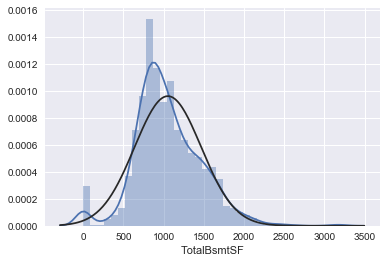


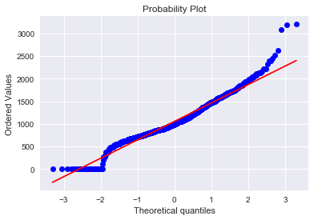


好了我们现在在面对一个重大的缺失，我们现在能做什么呢？  
- 把偏态给展示出来  
- 把观测值为0的数字统计出来（没有地下室的房子）
- 一个很重要的问题：含有0的数据不允许我们做log转换  

为了能够使用log转换，我们创建了一个新的变量表示有或者没有地下室。然后我们对那些新变量取值不为0的数据进行log处理，忽略那些值为0的数据。这样我们就可以转换数据同时不丢失是否有地下室的影响。  

我并不确定这种方式是否正确，在我看来他们是对的，这就是为什么我叫他们“高风险工程”


```python
# 给新的特征创建一列（一个就够了因为它只会取0和1）  
# 如果area>0，那么它=1，如果==0，那么它=0
df_train['HasBsmt']=pd.Series(len(df_train['TotalBsmtSF']),index=df_train.index)
df_train['HasBsmt']=0
df_train.loc[df_train['TotalBsmtSF']>0,'HasBsmt']=1
```


```python
# 转换数据
df_train.loc[df_train['HasBsmt']==1,'TotalBsmtSF']=np.log(df_train['TotalBsmtSF']                                                )
```


```python
# 矩形图和正态概率分布图
sns.distplot(df_train[df_train['TotalBsmtSF']>0]['TotalBsmtSF'],fit=norm);
fig=plt.figure()
res=stats.probplot(df_train[df_train['TotalBsmtSF']>0]['TotalBsmtSF'],plot=plt)

```


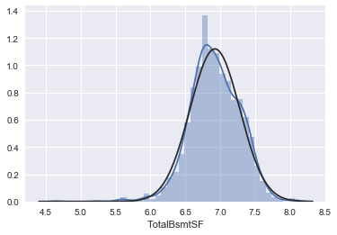


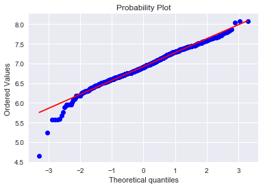


### 在第一次尝试中正确找到处理方差齐性的方法

测试两个矩阵变量方差齐性最好的方式就是使用图像。一些分布的分离的形状就像圆锥，有小部分分布在图的一边，一大部分分布在另一边，或者钻石（一大堆分布在中间地带）  

让我们接着从SalePrice和GrLivArea开始


```python
# 画出图像
plt.scatter(df_train['GrLivArea'],df_train['SalePrice']);
```


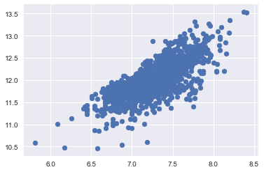


老版本的图像，在我们做log转换之前，是一个圆锥形，但现在，你可以看到形状不再是一个圆锥状，这就是正态性的强大。通过调整某些变量的正态性我们可以解决方差齐次性的问题。  

让我们现在来看看SalePrice和TotalBsmtSF


```python
# 画出图像
plt.scatter(df_train[df_train['TotalBsmtSF']>0]['TotalBsmtSF'],df_train[df_train['TotalBsmtSF']>0]['SalePrice']);
```


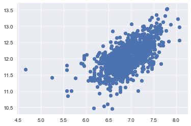


我们可以说，总的来说，SalePrice在TotalBsmtSF范围内表现出了相等的变化水平。太棒了！  

## 最后，哑变量处理

一个简单的调用


```python
# 把类别型变量转变为哑变量
df_train=pd.get_dummies(df_train)
```

## 总结

哇 我们终于到达了这个练习的最后。  

通过这个kernel，我们实践了许多在Hair et al上提到的策略。我们分析了变量，我们分析了单独的SalePrice，然后又分析了其他和它最相关的变量。我们处理了缺失数据和异常值，我们测试了一些基础的数据猜想，我们甚至把数据转为了哑变量。python把这些要做的工作变的简单了。  

但是我们的客人并没有结束。还记得我们的故事停在了脸书的搜索上吗？现在正是时候给SalePrice一个电话邀请他来和你共进晚餐了。尝试预测她的行为。你觉得她是个适合正则化线性回归的女孩吗？或者你觉得她喜欢合成的方法？或者她喜欢什么别的东西？   

现在轮到你来找到这些问题的答案了。  

## 引用目录

- Hair et al., 2013, Multivariate Data Analysis, 7th Edition（<a href="https://www.amazon.com/Multivariate-Data-Analysis-Joseph-Hair/dp/0138132631)">(https://www.amazon.com/Multivariate-Data-Analysis-Joseph-Hair/dp/0138132631</a>)  

## 感谢

感谢 João Rico 阅读这篇文章的草稿
